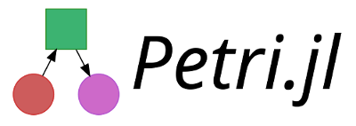

[](https://mehalter.github.io/Petri.jl/stable/)


`Petri.jl` is a Petri net modeling framework for the Julia programming language.

## Examples

We need to include our dependencies. `Petri` is the only requirement to build the models. `OrdinaryDiffEq` is required for simulating the network with and ordinary differential equation. `Plots` can be used to plot the solutions generated by `OrdinaryDiffEq`. `LabelledArrays` can be used to make things more readable, but is not necessary. Lastly, `Catlab` is required for visualizing the models as graphviz diagrams.

```julia
using Petri
using LabelledArrays
using OrdinaryDiffEq
using Plots
using Catlab.Graphics.Graphiz
import Catlab.Graphics.Graphviz: Graph
```

The SIR model represents the epidemiological dynamics of an infectious disease that causes immunity in its victims. There are three *states:* `Suceptible ,Infected, Recovered`. These states interact through two *transitions*. Infection has the form `S+I -> 2I` where a susceptible person meets an infected person and results in two infected people. The second transition is recovery `I -> R` where an infected person recovers spontaneously.


```julia
# define the structure of the model
sir = Petri.Model([:S,:I,:R],LVector(
                                inf=(LVector(S=1,I=1), LVector(I=2)),
                                rec=(LVector(I=1),     LVector(R=1))))

# define the initial conditions
u0 = LVector(S=100.0, I=1, R=0)

# define the parameters of the model, each rate corresponds to a transition
p = LVector(inf=0.05, rec=0.35)

# evaluate the expression to create a runnable function
f = toODE(sir)

# this is regular OrdinaryDiffEq problem setup
prob = ODEProblem(f,u0,(0.0,365.0),p)
sol = OrdinaryDiffEq.solve(prob,Tsit5())

# generate a graphviz visualization of the model
graph = Graph(sir)

# visualize the solution
plt = plot(sol)
```


Petri Nets are a simple language for describing reaction networks, you can make increasingly complex diseases. For example the `SEIR` model has an `Exposed` phase where people have the disease, but are not infectious yet.


```julia
seir = Petri.Model([:S,:E,:I,:R],LVector(
                                    exp=(LVector(S=1,I=1), LVector(I=1,E=1)),
                                    inf=(LVector(E=1),     LVector(I=1)),
                                    rec=(LVector(I=1),     LVector(R=1))))
u0 = LVector(S=100.0, E=1, I=0, R=0)
p = (exp=0.35, inf=0.05, rec=0.05)
f = toODE(seir)
prob = ODEProblem(f,u0,(0.0,365.0),p)
sol = OrdinaryDiffEq.solve(prob,Tsit5())
plt = plot(sol)
```


The previous models have transitory behavior, the infection spreads and then terminates as you end up with no infected people in the population. The following `SEIRS` model has a non-trivial steady state, because recovered people lose their immunity and become susceptible again.


```julia
seirs = Petri.Model([:S,:E,:I,:R],LVector(
                                    exp=(LVector(S=1,I=1), LVector(I=1,E=1)),
                                    inf=(LVector(E=1),     LVector(I=1)),
                                    rec=(LVector(I=1),     LVector(R=1)),
                                    deg=(LVector(R=1),     LVector(S=1))))
u0 = LVector(S=100.0, E=1, I=0, R=0)
p = LVector(exp=0.35, inf=0.05, rec=0.07, deg=0.3)
f = toODE(seirs)
prob = ODEProblem(f,u0,(0.0,365.0),p)
sol = OrdinaryDiffEq.solve(prob,Tsit5())
plt = plot(sol)
```


## Goals

`Petri` makes it easy to build complex reaction networks using a simple DSL. This is related to the[DiffeqBiological](https://github.com/JuliaDiffEq/DiffEqBiological.jl "DiffEqBiological") Reaction DSL, but takes a different implementation approach. Instead of building our framework around symbolic algebra and standard chemical notion, we are working off the Applied Category Theory approach to reaction networks [[Baez Pollard, 2017](http://math.ucr.edu/home/baez/RxNet.pdf "baezpollard2017")].

There are operations that are easy to do on the `Petri.Model` like "add a transition from R to S" that require simultaneously changing multiple parts of the algebraic formulation. Applied Category Theory gives a sound theoretical framework for manipulating Petri Nets as a model of chemical reactions. `Petri` is a Julia package primarily intended to investigate how we can operationalize this theory into practical scientific software.

See [SemanticModels](https://github.com/jpfairbanks/SemanticModels.jl) for tools that work with Petri net models and manipulating them with higher level APIs based on ACT.
