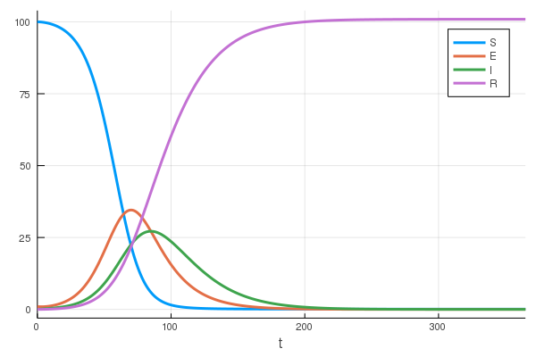

# Basic Usage

We need to include our dependencies. `Petri` is the only requirement to build the models. `OrdinaryDiffEq` is required for simulating the network with and ordinary differential equation. `Plots` can be used to plot the solutions generated by `OrdinaryDiffEq`. Lastly, `Catlab` is required for visualizing the models as graphviz diagrams.

```julia
using Petri
using OrdinaryDiffEq
using Plots
using Catlab.Graphics.Graphiz
import Catlab.Graphics.Graphviz: Graph
```

The SIR model represents the epidemiological dynamics of an infectious disease that causes immunity in its victims. There are three *states:* `Suceptible ,Infected, Recovered`. These states interact through two *transitions*. Infection has the form `S+I -> 2I` where a susceptible person meets an infected person and results in two infected people. The second transition is recovery `I -> R` where an infected person recovers spontaneously.


```julia
# define the structure of the model
sir = Petri.Model([:S,:I,:R],[(Dict(:S=>1,:I=>1), Dict(:I=>2)),
                              (Dict(:I=>1),       Dict(:R=>1))])

# define the initial conditions
u0 = [100.0, 1, 0]

# define the parameters of the model, each rate corresponds to a transition
p = [0.05, 0.35]

# evaluate the expression to create a runnable function
f = toODE(sir)

# this is regular OrdinaryDiffEq problem setup
prob = ODEProblem(f,u0,(0.0,365.0),p)
sol = OrdinaryDiffEq.solve(prob,Tsit5())

# generate a graphviz visualization of the model
graph = Graph(sir)

# visualize the solution
plt = plot(sol, labels=reshape(sir.S,1,:))
```


Petri Nets are a simple language for describing reaction networks, you can make increasingly complex diseases. For example the `SEIR` model has an `Exposed` phase where people have the disease, but are not infectious yet.


```julia
seir = Petri.Model([:S,:E,:I,:R],[(Dict(:S=>1,:I=>1), Dict(:I=>1,:E=>1)),
                                  (Dict(:E=>1),       Dict(:I=>1)),
                                  (Dict(:I=>1),       Dict(:R=>1))])
u0 = [100.0, 1, 0, 0]
p = [0.35, 0.05, 0.05]
f = toODE(seir)
prob = ODEProblem(f,u0,(0.0,365.0),p)
sol = OrdinaryDiffEq.solve(prob,Tsit5())
plt = plot(sol, labels=reshape(seir.S,1,:))
```



The previous models have transitory behavior, the infection spreads and then terminates as you end up with no infected people in the population. The following `SEIRS` model has a non-trivial steady state, because recovered people lose their immunity and become susceptible again.


```julia
seirs = Petri.Model([:S,:E,:I,:R],[(Dict(:S=>1,:I=>1), Dict(:I=>1,:E=>1)),
                                   (Dict(:E=>1),       Dict(:I=>1)),
                                   (Dict(:I=>1),       Dict(:R=>1)),
                                   (Dict(:R=>1),       Dict(:S=>1))])
u0 = [100.0, 1, 0, 0]
p = [0.35, 0.05, 0.07, 0.3]
f = toODE(seirs)
prob = ODEProblem(f,u0,(0.0,365.0),p)
sol = OrdinaryDiffEq.solve(prob,Tsit5())
plt = plot(sol, labels=reshape(seirs.S,1,:))
```


